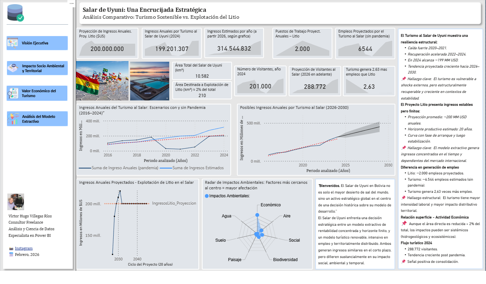

# Analisis-Estrategico-Salar-de-Uyuni
Análisis estratégico y dashboard en Power BI para evaluar los modelos de desarrollo (Turismo vs. Litio) en el Salar de Uyuni, Bolivia."

# Análisis Estratégico del Modelo de Desarrollo del Salar de Uyuni

### Turismo Sostenible vs. Explotación Extractiva de Litio

## 📖 Resumen del Proyecto

Este repositorio contiene un análisis integral y una herramienta de Business Intelligence desarrollada en Power BI para evaluar la encrucijada estratégica que enfrenta el Salar de Uyuni, Bolivia. El objetivo es comparar objetivamente dos modelos de desarrollo: el turismo sostenible, de horizonte infinito, y la explotación extractiva de litio, de ciclo finito.

Este proyecto transforma datos dispersos de fuentes oficiales, reportes técnicos y proyecciones metodológicas en una plataforma interactiva para la toma de decisiones basada en evidencia.

## 🚀 Hallazgos Clave

*   **Paridad de Ingresos, Disparidad de Impacto:** Ambos modelos proyectan ingresos anuales similares (~$200M USD), pero difieren radicalmente en su impacto social y ambiental.
*   **El Multiplicador Social del Turismo:** El modelo turístico demuestra generar de forma estable **2.6 veces más empleo** que el litio en su fase operativa.
*   **Riesgo Hídrico Crítico:** La Matriz de Leopold revela un impacto ambiental crítico del modelo extractivo sobre los recursos hídricos, que son la base del ecosistema y del turismo.
*   **Resiliencia Comprobada:** Un análisis contrafactual "sin pandemia" cuantifica el impacto de la crisis y demuestra la enorme resiliencia y el potencial de crecimiento del sector turístico.

## 🛠️ Componentes Técnicos y Metodología

Este análisis fue desarrollado utilizando un stack tecnológico moderno y metodologías avanzadas:

*   **Modelado de Datos:** Se diseñó un modelo en estrella robusto para asegurar el rendimiento y la coherencia de los datos.
*   **Business Intelligence:** La plataforma fue construida en **Power BI**, utilizando medidas **DAX** complejas para los cálculos y el análisis de escenarios.
*   **Análisis Avanzado:** Se implementaron técnicas como el **análisis contrafactual** y una **Matriz de Impacto Ambiental (Leopold)** para añadir profundidad al análisis.
*   **Inteligencia Artificial:** Se usaron modelos generativos como herramienta de soporte para la sistematización de información y la estructuración de la narrativa estratégica.

## 📂 Estructura del Repositorio

*   **/data:** Contiene todos los archivos `.csv` utilizados como fuente para el modelo de Power BI.
*   **/report:** Incluye el reporte final en formato `.pdf` y la propuesta técnica del proyecto.
*   **/visuals:** Contiene las imágenes `.png` de cada página del dashboard y un `.gif` demostrativo.
*   `Salar_de_Uyuni_Analisis.pbix`: El archivo fuente de Power BI con el modelo de datos, las relaciones, las medidas DAX y las visualizaciones.

## 🧑‍💻 Sobre el Autor

**Víctor Hugo Villegas Ríos**
Consultor Freelance en Análisis y Ciencia de Datos, especializado en Power BI.
*   **LinkedIn:** https://www.linkedin.com/in/victorhugovillegasrios/

---
*Este proyecto fue desarrollado como un caso de estudio independiente para demostrar las capacidades del análisis de datos en la evaluación de políticas de desarrollo territorial.*
